# JavaScript + TypeScript Architecture Diagrams

These diagrams provide visual revision for Weeks 1–3. They use Mermaid, so they can be viewed directly on GitHub.

---

## 1. JavaScript runtime architecture

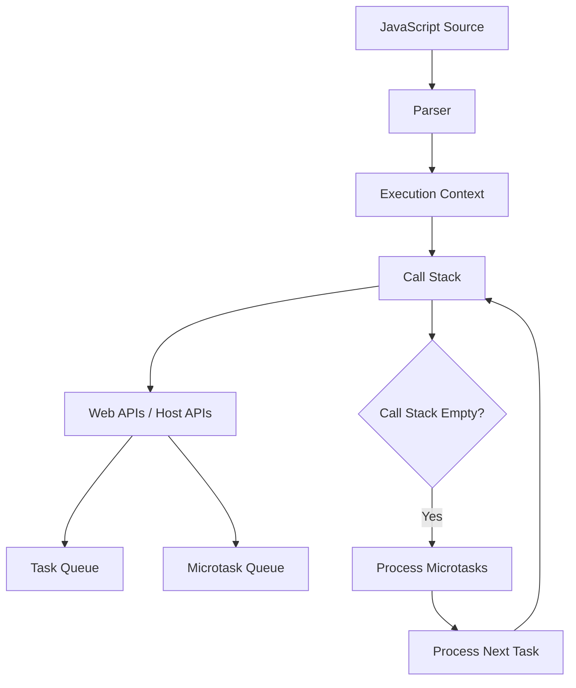

**Revision points:**

- The call stack executes synchronous code.
- Browser APIs handle timers, network requests, and DOM events.
- Promise reactions go to the microtask queue.
- Tasks such as timers and events are processed after microtasks.

---

## 2. Scope and closure model

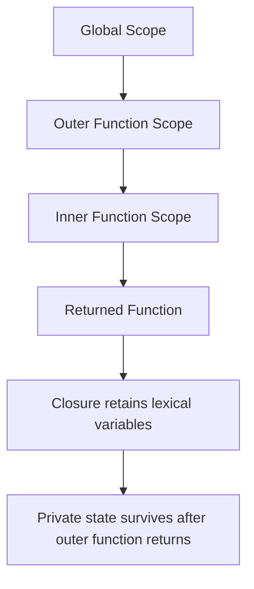

Example concept:

```js
function createCounter() {
  let count = 0;

  return function increment() {
    count += 1;
    return count;
  };
}
```

The returned function retains access to `count` because of closure behavior.

---

## 3. Promise lifecycle

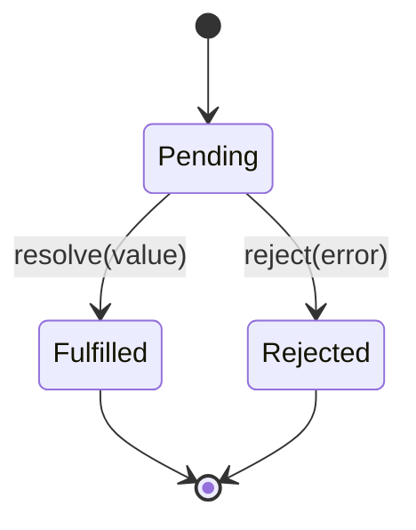

### Promise composition

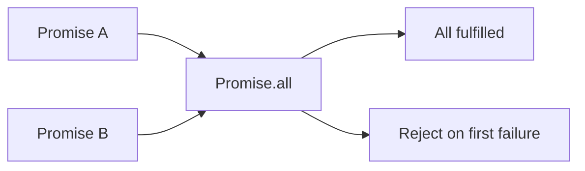

Use `Promise.allSettled` when every result is required even if some operations fail.

---

## 4. Debounce and throttle decision diagram

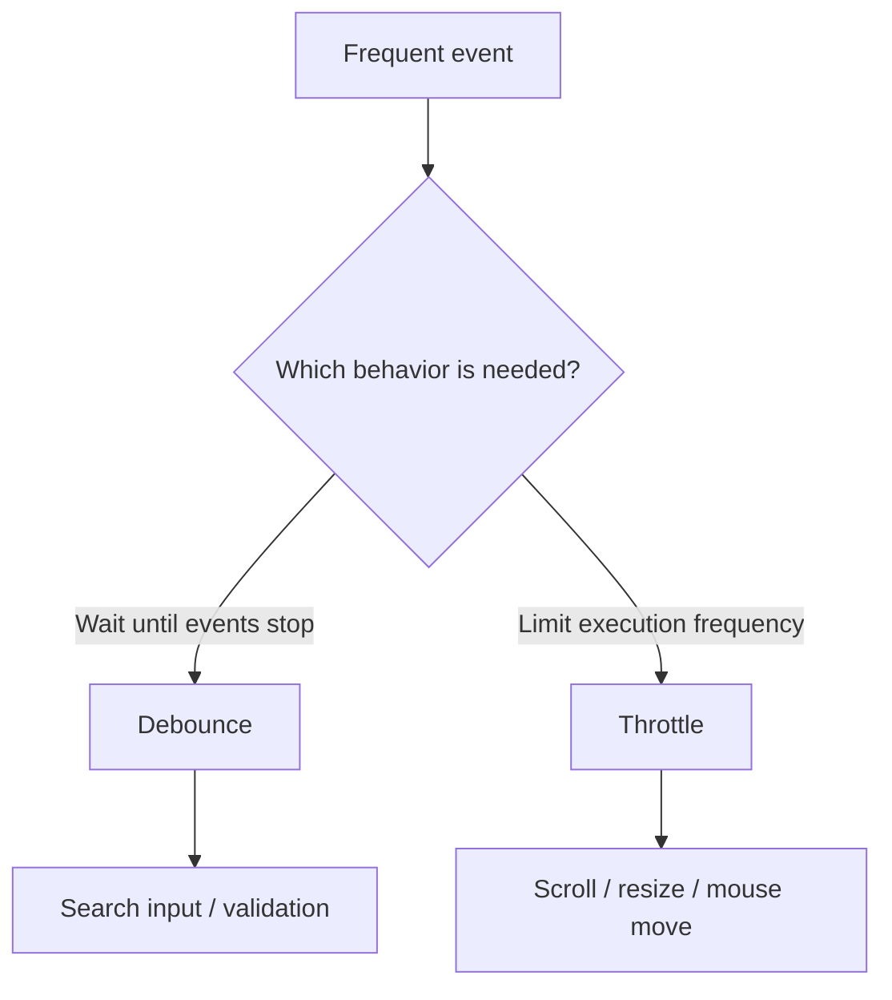

---

## 5. Object mutation and copying

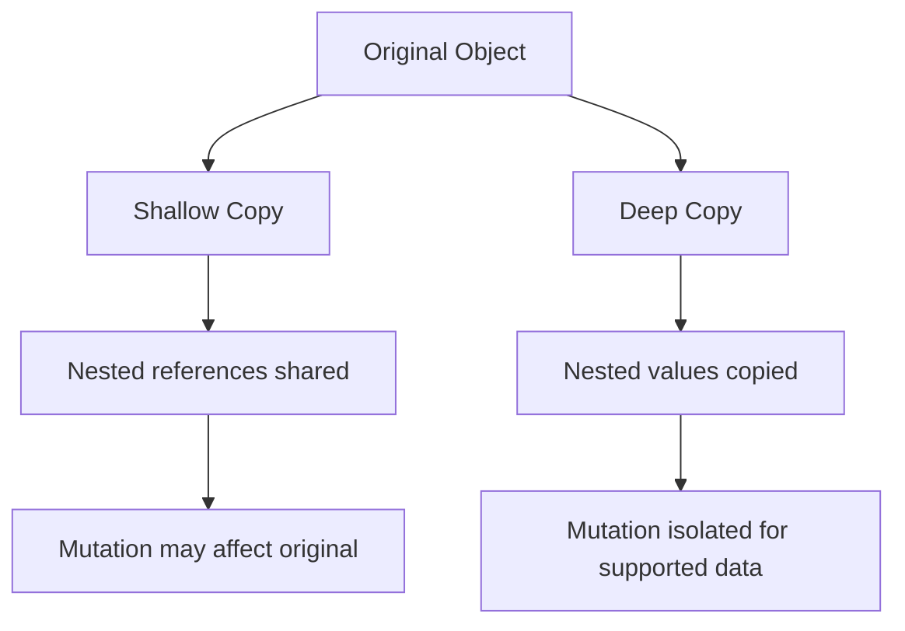

Remember: spread syntax and `Object.assign` are shallow-copy operations.

---

## 6. TypeScript compilation architecture

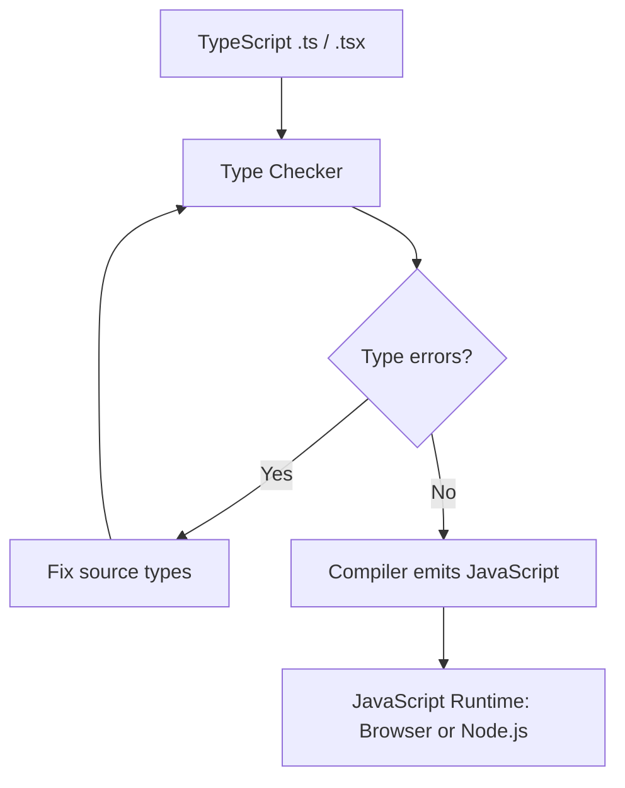

TypeScript types are removed during compilation; normal JavaScript runtime does not understand annotations such as `value: string`.

---

## 7. TypeScript type-system relationships

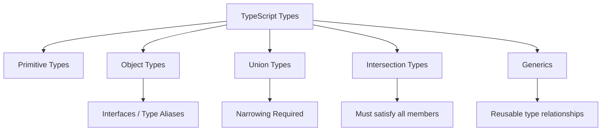

---

## 8. Type narrowing flow

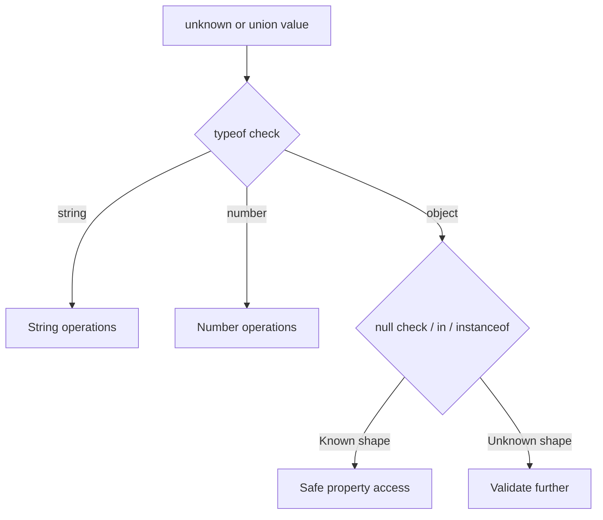

Typical narrowing tools:

- `typeof`
- `instanceof`
- `in`
- Equality checks
- Custom type predicates
- Discriminated union fields

---

## 9. Generic API response architecture

```mermaid
flowchart TD
    A[API Response] --> B[ApiResponse<T>]
    B --> C[ApiResponse<User>]
    B --> D[ApiResponse<User[]>]
    C --> E[Single user data]
    D --> F[User collection data]
```

Example:

```ts
interface ApiResponse<T> {
  success: boolean;
  data: T;
  message?: string;
}
```

Generics preserve the specific type of `data` without using `any`.

---

## 10. Discriminated union state machine

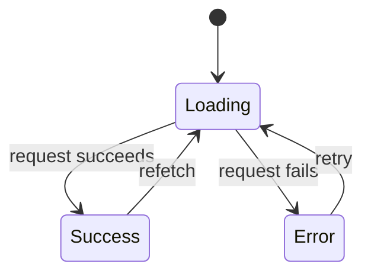

Type model:

```ts
type RequestState =
  | { status: "loading" }
  | { status: "success"; data: string[] }
  | { status: "error"; message: string };
```

The `status` field is the discriminant. It tells TypeScript which properties are available.

---

## 11. Frontend data flow using JavaScript and TypeScript

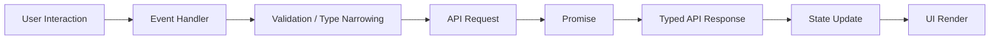

This is the bridge from the completed JavaScript and TypeScript foundations to React + TypeScript.

---

## Revision method

For each diagram, explain:

1. What each box represents.
2. What triggers movement to the next box.
3. One practical frontend example.
4. One common interview mistake.
5. Time or memory implications when relevant.
